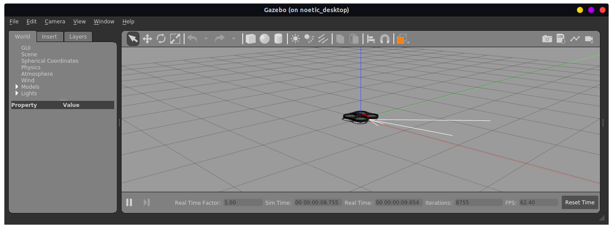
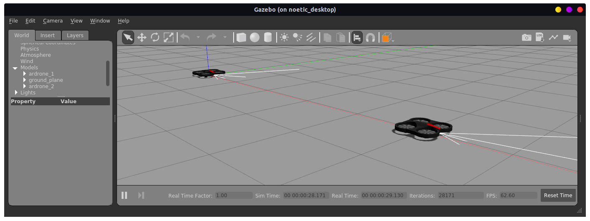
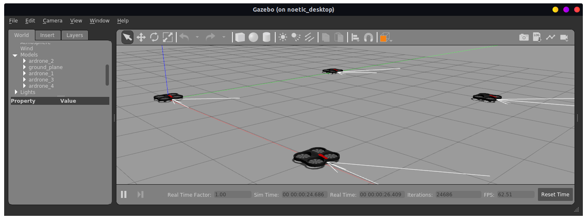
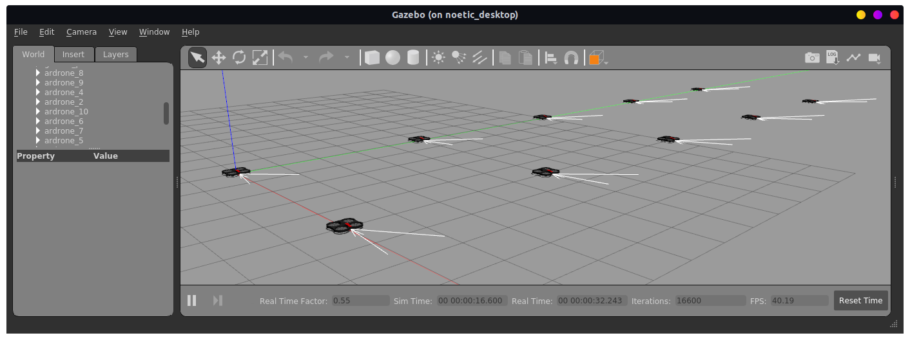

# The `ardrone_gazebo` ROS Noetic package

This `ardrone_gazebo` repository contains a ROS Noetic package to simulate the old but well known AR.Drone. The ROS package was
created by incorporating ideas, code and artefacts from [tum_simulator](http://wiki.ros.org/tum_simulator),
[sjtu_drone](https://github.com/tahsinkose/sjtu-drone/) and
[NovoG93/sjtu-drone](https://github.com/NovoG93/sjtu-drone) combined with a
(partial) clean-up and rewrite of a few source code files.

A single AR.Drone in an empty Gazebo world:
<p align="center">
  
</p>

## Features

- Simulates the AR.Drone in a standard ROS Noetic setup with Gazebo 11.
- Tries to mimic the original `tum_simulator`. (Currently far from perfect!)
- **Supports multiple concurrent AR.Drones in Gazebo!**
- All required external Git repositories are located on the [PXLRoboticsLab GitHub community](https://github.com/pxlroboticslab).


## Dependencies

- [ardrone_autonomy fork on PXLRoboticsLab](https://github.com/PXLRoboticsLab/ardrone_autonomy)
- [ardronelib fork on PXLRoboticsLab](https://github.com/PXLRoboticsLab/ardronelib)


## How to use

###  ROSNoeticDocker container

This `ardrone_gazebo` package, and all its dependencies, are included in the
[ROSNoeticDocker repository"(https://github.com/PXLAIRobotics/ROSNoeticDocker).
That repository was created for the AI & Robotics courses at the PXL University 
of Applied Sciences and Arts. But it's free for all to use!

It's the most convenient way to get up and running with the `ardrone_gazebo`
package. Just clone the ROSNoeticDocker repository, build and run the
container and you're ready to start the AR.Drone in Gazebo.


### Manual install in own workspace
If you want to make changes to the `ardrone_gazebo` package, it's advised to
install it in your own ROS Noetic workspace. (Don't use the ROENoeticDocker to
do this, unless you're comfortable purging the `ardrone_gazebo` build statements
form the Dockerfile before building the image.)


#### Prerequisites

- Basic bash, git &amp; ROS knowledge
- An installed and working ROS Noetic distribution
- Gazebo 11 installed.
- A sourced Catkin workspace


#### Installation steps
Setting up the `ardrone_gazebo` package in your own workspace is super easy.
Just clone two repositories, build and source the workspace.

```bash
<in your workspace dir> $ cd src
<in your workspace dir>/src $ git clone https://github.com/PXLRoboticsLab/ardrone_autonomy
<in your workspace dir>/src $ git clone https://github.com/PXLRoboticsLab/ardrone_gazebo
<in your workspace dir>/src $ cd ..
<in your workspace dir> $ catkin_make
<in your workspace dir> $ source devel/setup.bash
```

After this, you're ready to start the AR.Drone in Gazebo.


## Running the simulator
There are a few `launch` files included with this repository.

### A single drone

```bash
<On your ROS system>$ roslaunch ardrone_gazebo single_ardrone.launch 
```

<p align="center">
  
</p>

### Two drones

```bash
<On your ROS system>$ roslaunch ardrone_gazebo two_ardrones.launch 
```

<p align="center">
  
</p>

### Four drones

```bash
<On your ROS system>$ roslaunch ardrone_gazebo four_ardrones.launch 
```

<p align="center">
  
</p>

### Ten drones

```bash
<On your ROS system>$ roslaunch ardrone_gazebo ten_ardrones.launch 
```

<p align="center">
  
</p>
